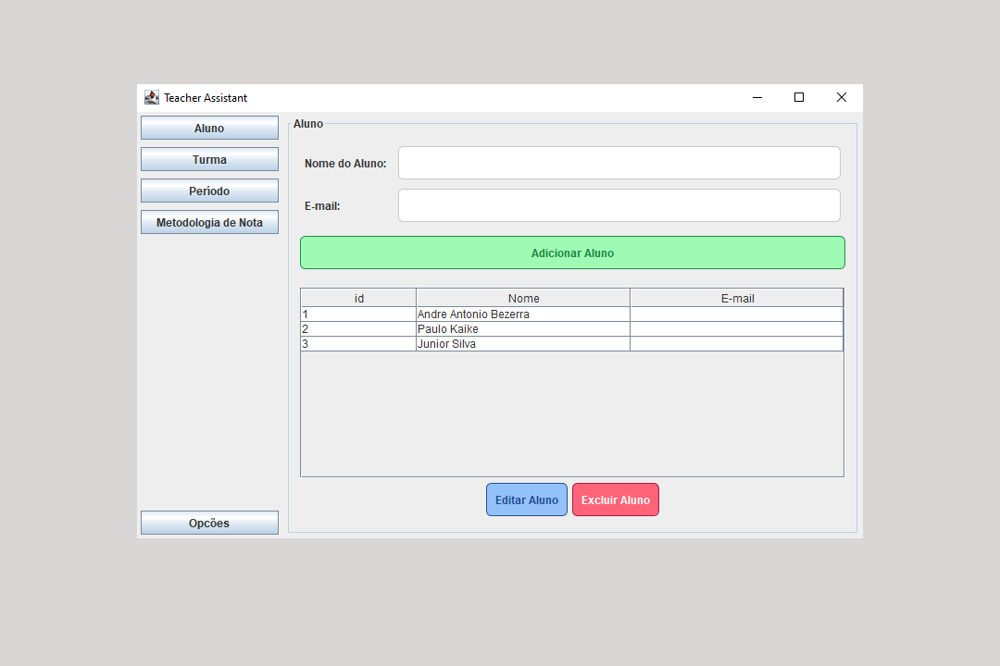

# Teacher Assistant

É uma aplicação desenvolvida em Java com o objetivo de facilitar o trabalho dos professores na criação de metodologias para a composição de notas e no acompanhamento do progresso individual de seus alunos.

Com a ferramenta, o professor pode criar critérios personalizados para avaliar o desempenho dos estudantes. Por exemplo, a nota de um período pode ser composta da seguinte forma:

* Prova – 5 pontos
* Trabalho Apresentado – 2 pontos
* Entrega Rápida – 1 ponto
* Participação na Aula – 1 ponto
* Frequência – 1 ponto

A partir desses critérios, o professor pode configurar a metodologia diretamente no sistema e avaliar cada aluno de forma individual, registrando as pontuações e monitorando o desempenho ao longo do período letivo.

### Objetivo 

O projeto foi criado para compor a nota Final de POO - Estágio 3 da faculdade Unifip (Patos-PB).
Mais detalhes da metodologia aplicada: https://pabloroberto.notion.site/Projeto-Final-de-POO-Est-gio-3-f5e51dae644746fa9a4a0b66855e55a5

### Implementação

Para implementação foi utilizada a linguagem de programação Java com a biblioteca gráfica Swing para criação da interface.

Foi adotado o padrão de arquitetura MVC para separar a camada de lógica da aplicação da camada da interface, melhorando assim a manutenção e promovendo a organização do projeto.

### Java Swing

Java Swing é uma biblioteca gráfica para criar interfaces de usuário (GUI) em aplicações Java. Ela faz parte do Java Foundation Classes (JFC) e oferece um conjunto rico de componentes para desenvolver aplicações desktop robustas e visualmente atraentes.

### MVC

MVC é um padrão de arquitetura de software que separa o código fonte em três camadas: Model (modelo), View (visão) e Controller (controle).

### Referências

* Java - https://www.java.com/pt-BR/
* Java Swing - https://docs.oracle.com/javase/8/docs/api///?javax/swing/package-summary.html
* Padrão MVC em Java - https://www.devmedia.com.br/padrao-mvc-java-magazine/21995
